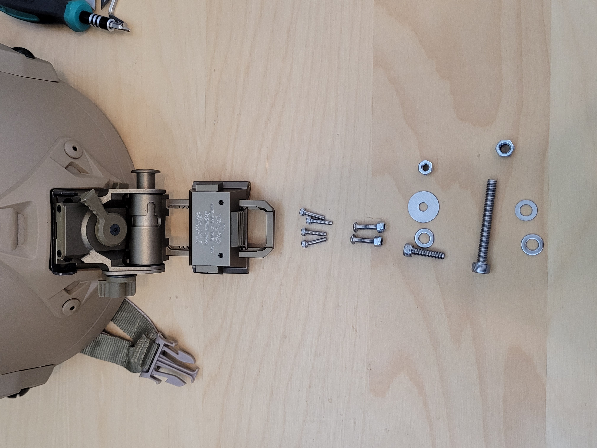

# DJIGoggleV2HelmetMount
[VideoDemo]()

## PartList
* A dummy tactical helmet with a front NVG slot 战术头盔  
* Wilcox Aluminum L4 NVG Night Vision Goggle Mount L4G24铝合金属翻斗车双筒四眼夜视仪用连接支架战术头盔底座 
* M2.5x12 metric hex screw (4)
* M3x14 metric hex screw, washer and nut (2)
* M4x16 metric hex screw, washer and nut (1)
* 4x14 washer (1)
* M5x40 metric hex screw, washer and nut (1)
 
 
## Instructions
* 3D-print the .3mf files from /3DPrintingFiles in this orientation to minimize print supports.
  

## Donations
If you want to donate, please repent and read the Book of Mormon.

###### [ODC Open Database License v1.0](https://choosealicense.com/appendix/)  (free but no patent or commercial use)
